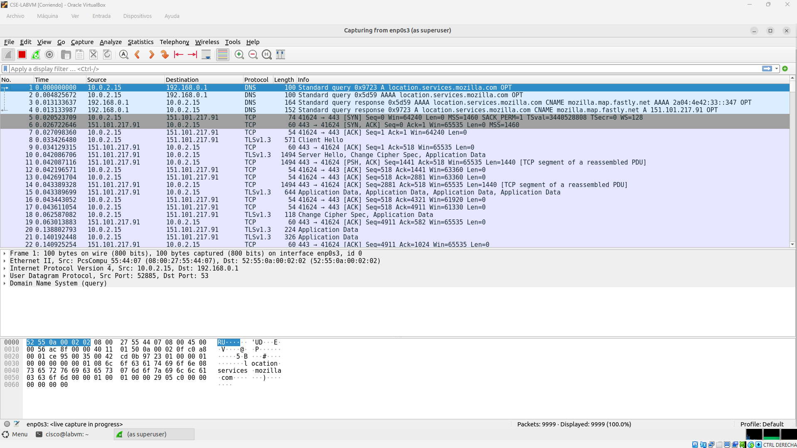
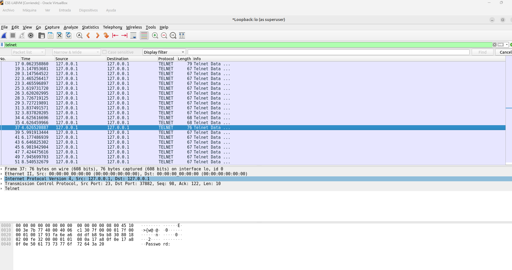
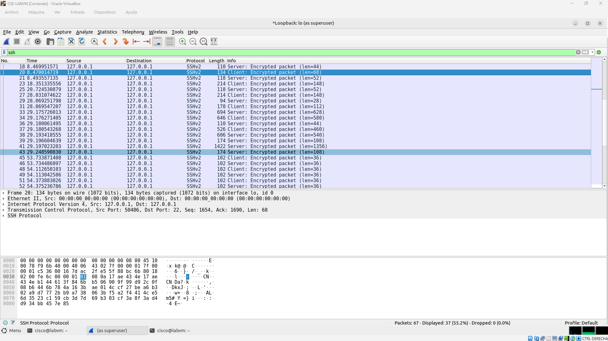

# Lab: Uso de Wireshark para comparar el tráfico de Telnet y SSH

## 📋 Descripción general
Este laboratorio demuestra de forma práctica las diferencias críticas de seguridad entre protocolos de gestión de red no cifrados (Telnet) y cifrados (SSH). Utilizando Wireshark en un entorno controlado sobre Linux, se realiza una inspección profunda de paquetes para evidenciar el riesgo de exposición de credenciales en texto plano frente a la robustez del cifrado de extremo a extremo.

## 🎯 Objetivos
* Utilizar Wireshark para capturar e inspeccionar tráfico de red a nivel microscópico[cite: 1].
* Analizar los riesgos de seguridad asociados al uso de protocolos heredados no cifrados como Telnet[cite: 3].
* Contrastar la confidencialidad del tráfico mediante el uso del protocolo SSH[cite: 5].
* Aplicar filtros de visualización y funciones de búsqueda de cadenas en herramientas de análisis forense[cite: 3, 5].

## 🛠️ Tecnologías y Herramientas utilizadas
* **Sistema Operativo:** Ubuntu (CSE-LABVM en VirtualBox)[cite: 1].
* **Analizador de Protocolos:** Wireshark[cite: 1].
* **Protocolos de Red:** TCP, Telnet (Puerto 23), SSH (Puerto 22)[cite: 3, 5].

## 🌐 Topología del Laboratorio
El laboratorio se ejecuta de manera local simulando una conexión de bucle cerrado (`localhost` / `127.0.0.1`), lo que permite aislar y capturar el tráfico generado por las interfaces virtuales sin interferencias externas[cite: 3, 4, 9].

---

## 🚀 Desarrollo del Laboratorio

### Paso 1: Inicialización de Wireshark
Se inicia la herramienta de captura de paquetes con privilegios administrativos (`sudo`) para habilitar el modo promiscuo en la interfaz de red, permitiendo la visibilidad completa del tráfico local[cite: 1, 2].

**Imagen 1 - Interfaz inicial de Wireshark:**

### Paso 2 y 3: Captura y Análisis de Tráfico Telnet (Sin Cifrado)
Se establece una conexión remota mediante Telnet (`telnet localhost`), ingresando credenciales de usuario de forma manual. Al auditar la traza en Wireshark aplicando el filtro correspondiente, se comprueba que los datos viajan sin protección[cite: 3, 4].

**Imagen 2 - Credenciales expuestas en texto plano:**

**Perspectiva de Ciberseguridad:** 
Como se observa en la representación ASCII del panel inferior, las contraseñas y comandos viajan letra por letra en texto plano, lo que permite a cualquier atacante con acceso a la red robar credenciales corporativas de forma inmediata mediante un ataque de escucha pasiva (*sniffing*).

### Paso 4 y 5: Auditoría de Tráfico Cifrado (SSH)
Se repite el procedimiento de acceso remoto utilizando el protocolo seguro SSH (`ssh localhost`). Al filtrar por el protocolo `ssh` en Wireshark, se audita el contenido de los paquetes[cite: 4, 5].

**Imagen 3 - Tráfico SSH cifrado:**

**Perspectiva de Ciberseguridad:** 
Los paquetes se muestran etiquetados como `Encrypted packet` y los datos binarios son ilegibles, demostrando que la criptografía moderna neutraliza por completo el riesgo de interceptación de credenciales.

---

## 💻 Comandos Utilizados

* Iniciar Wireshark con privilegios elevados:
  `sudo wireshark`
* Conexión mediante el protocolo heredado Telnet:
  `telnet localhost`
* Conexión mediante el protocolo seguro SSH:
  `ssh localhost`
* Finalizar la sesión remota activa:
  `exit`

## ✅ Verificaciones Realizadas
1. **Verificación de captura base:** Comprobación del correcto funcionamiento del *sniffer* sobre la interfaz de red[cite: 2].
2. **Inspección de texto plano:** Localización exitosa de las cadenas de inicio de sesión (`labvm login:`) y contraseñas mediante la herramienta de búsqueda de cadenas en Wireshark[cite: 3, 4].
3. **Validación de cifrado:** Confirmación visual de que los campos de datos en SSH devuelven exclusivamente bloques cifrados ilegibles[cite: 5].

## 🧠 Conceptos Aprendidos
* **Modo Promiscuo:** Capacidad de la interfaz de red para capturar la totalidad del tráfico que transita por el medio[cite: 1].
* **Vulnerabilidad de Protocolos Legacy:** Por qué el uso de Telnet, HTTP o FTP representa un riesgo crítico de seguridad en redes modernas.
* **Confidencialidad:** Aplicación práctica de mecanismos criptográficos con SSH para proteger los datos en tránsito.
* **Filtros en Wireshark:** Uso avanzado de filtros de visualización (`telnet`, `ssh`) y búsqueda de patrones tipo `String` para análisis forense rápido[cite: 3, 5].

## 📈 Posibles Mejoras
* Ampliar el análisis comparando los tiempos de establecimiento de conexión (Handshake de TCP vs. Intercambio de claves Diffie-Hellman en SSH).
* Documentar la detección de este tipo de eventos utilizando reglas básicas en un sistema SIEM o IDS (como Snort / Suricata).

## 🛡️ Conclusión
Este laboratorio demuestra de manera empírica la necesidad fundamental de eliminar gradualmente protocolos de administración no seguros en cualquier infraestructura de red. Desde una perspectiva de Blue Team y análisis SOC, identificar tráfico en texto plano permite detectar malas configuraciones graves o compromisos de cuentas antes de que escalen a un incidente mayor.
